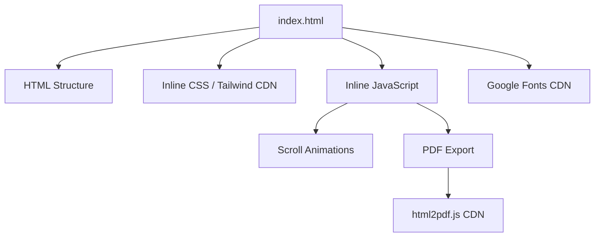

# Architecture

## Overview

CV Galih Prasetyo adalah **static site** satu halaman (*single-page*) tanpa framework JavaScript. Semua konten, styling, dan interaktivitas terkandung dalam satu file HTML.

## Komponen Halaman

1. **Header / Hero** — Nama, gelar, tautan sosial
2. **Ringkasan** — Profil profesional singkat
3. **Proyek** — Grid portofolio dengan kartu
4. **Pengalaman** — Timeline kerja
5. **Pendidikan** — Riwayat pendidikan
6. **Sertifikasi** — Sertifikat
7. **Footer** — Hak cipta

## Desain

- **Dark theme** dengan gradien animasi
- **JetBrains Mono** untuk kode, **Inter** untuk teks
- Warna tematik Python (biru/kuning)
- Scrollbar kustom

## Berkas Pendukung

| Berkas | Fungsi |
|--------|--------|
| `index.html` | Halaman utama CV interaktif |
| `cv-clean.html` | Versi bersih tanpa styling berat |
| `cv-print.html` | Versi khusus cetak |
| `Galih_Prasetyo_AI_Engineer_CV.pdf` | CV versi PDF statis |
| `foto.jpeg` | Foto profil |

## Lihat Juga

- [[tech-stack|Tech Stack]]
- [[modules|Struktur Berkas]]
- [[features|Fitur]]
